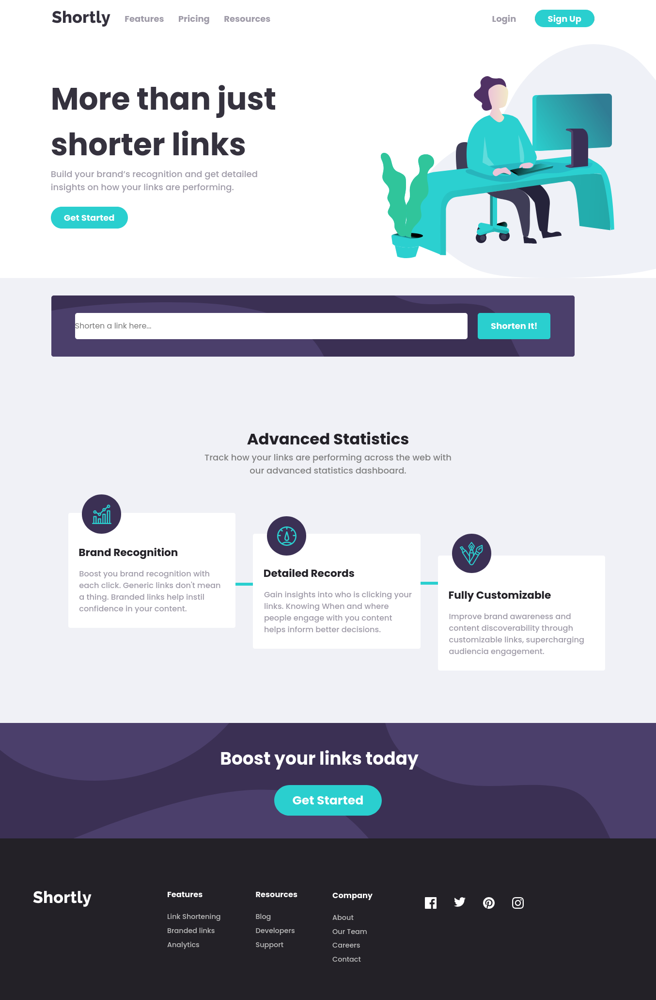

# Frontend Mentor - Shortly URL shortening API Challenge solution

This is a solution to the [Shortly URL shortening API Challenge challenge on Frontend Mentor](https://www.frontendmentor.io/challenges/url-shortening-api-landing-page-2ce3ob-G).

## Table of contents

- [Overview](#overview)
  - [The challenge](#the-challenge)
  - [Screenshot](#screenshot)
  - [Links](#links)
- [My process](#my-process)
  - [Built with](#built-with)
  - [What I learned](#what-i-learned)
  - [Useful resources](#useful-resources)
- [Author](#author)

## Overview

### The challenge

Users should be able to:

- View the optimal layout for the site depending on their device's screen size
- Shorten any valid URL
- Copy the shortened link to their clipboard in a single click
- Receive an error message when the `form` is submitted if:
  - The `input` field is empty

### Screenshot



### Links

- Solution URL: [Github](https://github.com/EuCaue/url-shortening-api)
- Live Site URL: [Vercel](https://url-shortening-api-indol.vercel.app/)

## My process

### Built with

- Semantic HTML5/TSX markup
- CSS custom properties
- Flexbox
- Desktop-first workflow
- [React](https://reactjs.org/) - JS library
- [Typescript](https://www.typescriptlang.org/) - TS
- [Styled Components](https://styled-components.com/) - For styles
- [Vercel](https://vercel.com) - Host the project
- [Vite](https://vitejs.dev/) - For development
- [Axios](https://axios-http.com/) - JS library

### What I learned

```javascript
<UlList
        H1="Company"
        li1="About"
        li2="Our Team"
        li3="Careers"
        li4="Contact"
      />
```

```css
 @keyframes box {
      from {
        top: 1.5em;
      }
      25% {
        top: 2.5em;
      }

      50% {
        top: 3.5em;
      }
      to {
        top: 5em;
      }
    }
}
```

```typescript
const responseApiMap = useCallback(
    (): JSX.Element[] =>
      responseApi.map(
        (api, index): JSX.Element => <div key={index}>{api}</div>,
      ),
    [responseApi],
  );
}
```

### Useful resources

- [React](https://reactjs.org)
- [Typescript](https://www.typescriptlang.org/)
- [Styled Components](https://styled-components.com/)

## Author

- Website - [Github](https://www.github.com/EuCaue)
- Frontend Mentor - [@EuCaue](https://www.frontendmentor.io/profile/EuCaue)
- Linkedin - [Cauê Souza](https://www.linkedin.com/in/caue-souza/)
